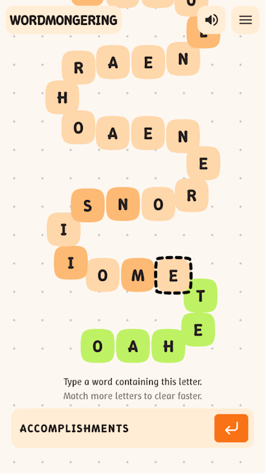
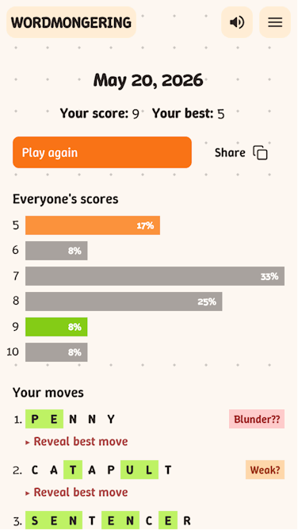

# Wordmongering

Try it out at [wordmongering.com](https://wordmongering.com)
| Solve daily puzzles      | Analyze your moves               |
| ------------------------ | -------------------------------- |
|  |  |

## TODO

- favicon
- homepage logo

- nations/nationalities

- improve tui
- improve everything else

## Ideas

- snake
- spiral
- cerberus
- hydra

## Words

`words.txt` is based on the [Letterpress word list](https://github.com/lorenbrichter/Words). Changes after 7a08f2f are my own.

I am working on adding recent words like "looksmaxxing" and common proper nouns and proper adjectives like "Wednesday".

Also trying to reduce bad entries. It's ~60% historical garbage, but filtering out false positives is tedious. Goal is for `words.txt` to be 1.4MB (~500kB gzipped), currently 2.8MB (~900kB gzipped).

`super25k.txt` is a semi-hand curated list of words that have a letter superset of popular words from https://www.wordfrequency.info and https://github.com/dolph/dictionary. These are words a native speaker can reasonably be expected to know and represent near-optimal plays (i.e, almost all top 25k popular words are a letter subset of some word in this list).

## Develop

Make sure to access development site via vite's port (probably localhost:5173). Api requests are proxied by vite to a different port.

```sh
make install

# vite dev server, proxied go backend, accessible on lan
make dev

# admin tui
make dash
```

## Deploy

The gameplay is self-contained in `client`. Just build the static files.

```sh
git clone https://github.com/zhengkyl/wordmongering
cd client
VITE_WM_EPOCH=2026-04-27 pnpm build
```

### Backend for Score tracking + Feedback

The server listens at `localhost:2704`. It expects the `X-Real-IP` header for rate-limiting.

#### From image

```sh
# Download compose.yaml
curl -O https://raw.githubusercontent.com/zhengkyl/wordmongering/refs/heads/authoritative/compose.yaml

# Start server
docker compose up -d

# admin tui
docker exec -it <container_id_or_name> dash
```

#### From source

```sh
git clone https://github.com/zhengkyl/wordmongering
cd wordmongering
make install
make build

# Start server
STATIC_DIR=client/dist DB_PATH=data/app.db PORT=2704 WM_EPOCH=2026-04-27 ./bin/server

# admin tui
STATIC_DIR=client/dist DB_PATH=data/app.db WM_EPOCH=2026-04-27 ./bin/dash
```
