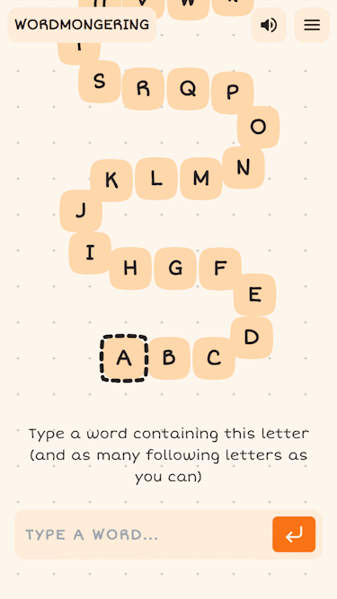

# Wordmongering



## Todo

## Ideas

- 10 word limit
- no repeat words
- tutorial hint

- snake
- spiral
- cerberus
- hydra

## Dictionary

`dictionary.txt` is based on the [Letterpress word list](https://github.com/lorenbrichter/Words) (CC0). Changes after 7a08f2f are my own.

### Other word lists

- https://github.com/dwyl/english-words
  - missing all words starting with y
- https://github.com/words/an-array-of-english-words
  - letterpress word list + 4 words and 7 non-words

## Development

Make sure to access development site via vite's port (probably localhost:5173). Api requests are proxied by vite to port 3000 (hardcoded in vite.config.ts and main.go)

```sh
make install

# This starts client (vite) and backend server.
make dev
```

## Deploy

The server listens at `localhost:3000`. It expects the `X-Real-IP` header for rate-limiting.

### Docker Compose

```sh
# Download compose.yaml
curl -O https://raw.githubusercontent.com/zhengkyl/wordmongering/refs/heads/authoritative/compose.yaml

# Start server
docker compose up -d

# Open admin tui
docker exec -it <container_id_or_name> /bin/dashboard
```

### Node

```sh
git clone https://github.com/zhengkyl/wordmongering

cd wordmongering

make install

make build

# Start server
make start

# Open admin tui
make start-dash
```
